# Práctica 3 Modelado y Simulación de Robots
## Carla García Alejandre
-------------------------------------------------------------------------------------

## Introducción
El objetivo de esta práctica es configurar y controlar un rover móvil con brazo manipulador utilizando ROS2 y MoveIt. Para ello, se parte del modelo desarrollado en la práctica anterior en Blender, adaptándolo para su integración en el ecosistema ROS mediante archivos URDF/XACRO.

### Índice
- [Modularización del robot en distintos archivos XACRO](https://github.com/carlagale/p3_msr#creaci%C3%B3n-de-xacros)
- [Configuración del modelo cinemático y dinámico](https://github.com/carlagale/p3_msr#modelo-del-robot)
- [Integración con MoveIt para la manipulación del brazo robótico](https://github.com/carlagale/p3_msr#configuraci%C3%B3n-de-moveit)
- [Teleoperación de la base móvil](https://github.com/carlagale/p3_msr#ejecuci%C3%B3n)
- [Captura y análisis de datos mediante rosbag](https://github.com/carlagale/p3_msr#an%C3%A1lisis-del-mecanismo)

## Creación de xacros
La primera etapa de la práctica consistió en reorganizar el archivo URDF exportado desde Blender en múltiples archivos XACRO independientes. Esta modularización facilita el mantenimiento del robot y permite reutilizar componentes de forma más sencilla.

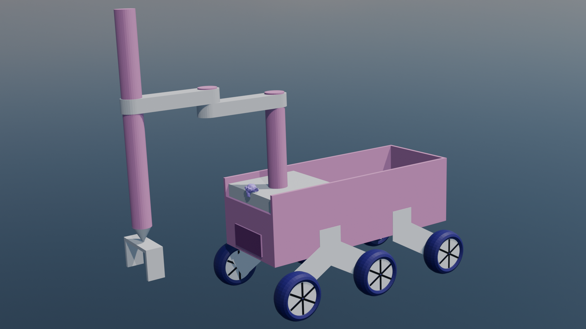

Todo este procesos se realiza dentro del paquete `rover_description`, donde se definen todas las intsncias relativas a la generación del propio robot y sus componentes.

Dentro del directorio `urdf` podemos encontrar: 

```bash
urdf
├── arm
│   ├── gripper.urdf.xacro
│   └── scara.urdf.xacro
├── base
│   └── robot_base.urdf.xacro
├── ros2_control.urdf.xacro
├── sensors
│   ├── camera.urdf.xacro
│   ├── gps.urdf.xacro
│   └── imu_sensor.urdf.xacro
├── utils
│   └── utils.urdf.xacro
└── wheels
    └── wheels.urdf.xacro
```

Cada archivo contienen una parte concreta del robot. Dentro de la definición del brazo robótico tipo scara, se hace una distinción entre el [gripper](rover_description/urdf/arm/gripper.urdf.xacro) y el propio [scara](rover_description/urdf/arm/scara.urdf.xacro) para un control más eficiente. En la [base](rover_description/urdf/base/robot_base.urdf.xacro) encontraríamos la definición del chasis principal del rover junto a sus links hijos fijos, correspondientes a los distintos sensores y elementos estructurales del robot. Además, se define el frame `base_footprint`, utilizado como referencia plana del robot respecto al suelo. Este frame resulta especialmente útil en navegación y localización, ya que mantiene únicamente la posición y orientación en el plano XY, ignorando inclinaciones producidas por el terreno o por el modelo físico.

Por otro lado entoncramos las [ruedas](rover_description/urdf/wheels/wheels.urdf.xacro) que serán controladas para que el robot pueda desplazarse. Además, encontramos [sensores](rover_description/urdf/sensors/), tipo cámara, gps e imu y [utils](rover_description/urdf/utils/utils.urdf.xacro) donde se encuentran los amteriales y las matrices de inercia.

Posteriormente, todos estos archivos se incluyen desde un único archivo principal [robot.urdf.xacro](rover_description/robots/robot.urdf.xacro), encargado de instanciar cada subsistema indicando el link padre, las posiciones relativas y las orientaciones correspondientes.


## Modelo del robot
Para visualizar el modelo del robot en RViz se utiliza el nodo `robot_state_publisher`, encargado de publicar las transformadas `TF` correspondientes al modelo cinemático definido en el URDF.

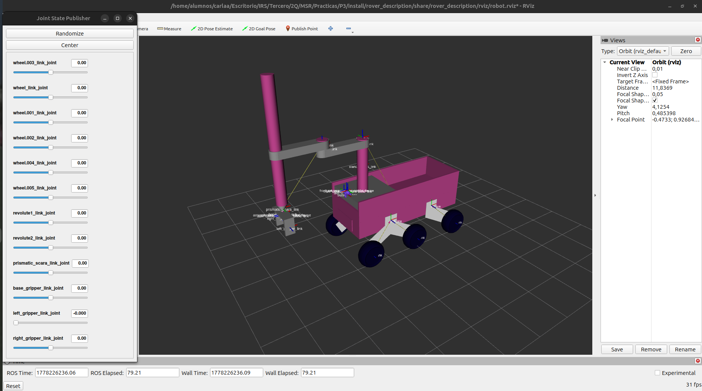

### Árbol de transformadas
El robot se encuentra compuesto por múltiples sistemas de referencia conectados jerárquicamente mediante transformadas TF. Estas transformadas permiten conocer en todo momento la posición relativa de cada link, la orientación de cada articulación y la relación espacial entre sensores y actuadores.

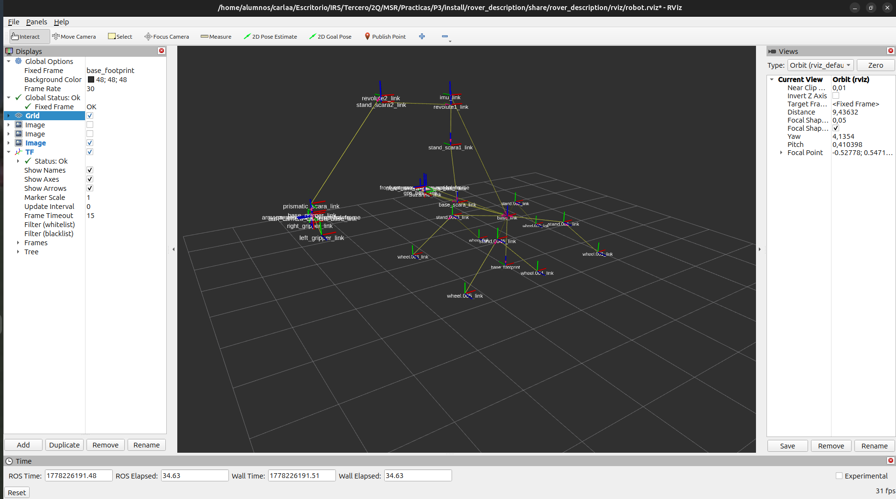

Además, se generó el árbol completo de transformadas utilizando

```bash
ros2 run rqt_tf_tree rqt_tf_tree
```

El resultado muestra la jerarquía completa del robot desde base_link hasta el extremo final del brazo manipulador.

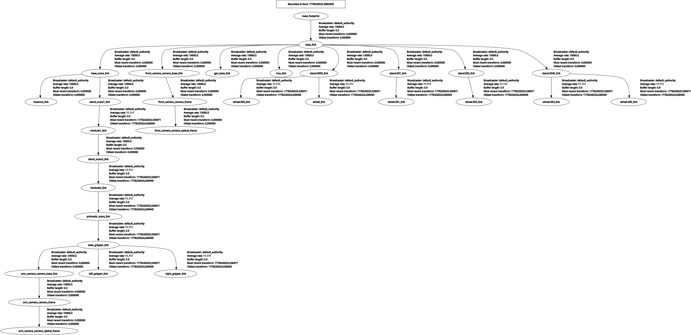

### Joints
Para verificar que las articulaciones se encuentran correctamente configuradas se utilizó la interfaz `joint_state_publisher_gui`.

Esta herramienta permite modificar manualmente los valores de cada joint mediante barras deslizantes y comprobar visualmente el comportamiento del robot en RViz. Gracias a esta comprobación fue posible validar los límites articulares, el sentido de giro y la correcta propagación de las transformadas.

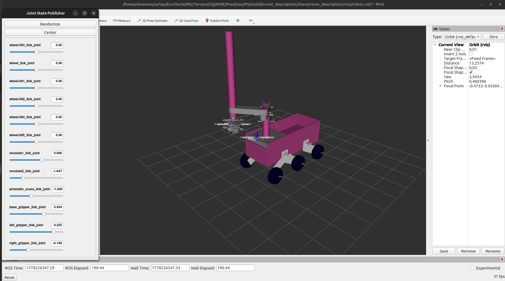

## Entorno
La simulación se desarrolla en el entorno urjc_excavation_msr del paquete [urjc-excavation-world](urjc-excavation-world/), el cual contiene el rover situado inicialmente en el origen y tres cubos de distintos colores distribuidos por el escenario.

La disposición de los objetos obliga al robot a realizar tanto tareas de navegación como de manipulación. Concretamente, el cubo verde debe almacenarse en el compartimento del rover,
mientras que el cubo azul debe colocarse encima del cubo rojo.

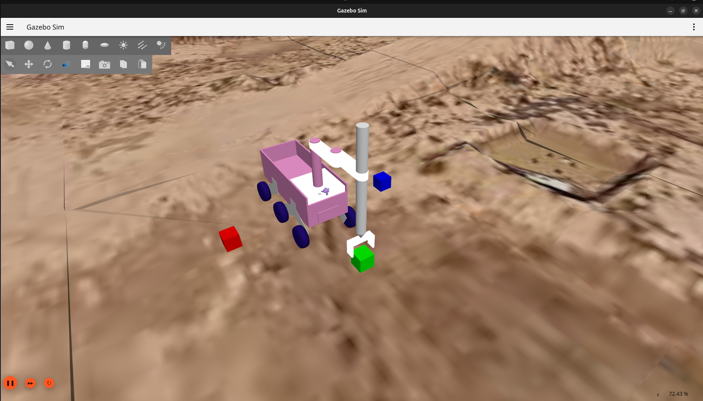

La simulación del robot en el entoeno se lanza mediante

```bash
ros2 launch rover_Description robot_gazebo.launch.py world_name:=urjc_excavation_msr
```

## Configuración de Moveit
Esta parte de la práctica se desarrolla en `rover_moveit_config`.

Para generar las trayectorias del brazo manipulador se utilizó `MoveIt Setup Assistant`.

```bash
source install/setup.bash

ros2 launch moveit_setup_assistant setup_assistant.launch.py
```

Esta herramienta permitió generar automáticamente el paquete de configuración de `MoveIt` a partir del modelo URDF del robot, definiendo las cadenas cinemáticas, los grupos de planificación y los límites articulares necesarios para el correcto funcionamiento del sistema de planificación de movimientos.

La configuración generada incluye el archivo `SRDF` del robot, donde se especifican los grupos de joints y configuraciones semánticas, además de distintos parámetros cinemáticos, límites de velocidad y aceleración, y los controladores asociados tanto al brazo manipulador como a la pinza. Posteriormente fue necesario realizar varios ajustes manuales sobre los archivos de configuración generados con el objetivo de adaptar `MoveIt` al comportamiento específico del rover y garantizar una integración correcta con los controladores definidos mediante `ros2_control`.

```bash
ros2 launch rover_moveit_config move_group.launch.py
```

## Controladores
El robot utiliza varios controladores independientes basados en `ros2_control`.

Se configuraron distintos controladores para segurar una manipulación óptima del rover.
- Controlador para las ruedas.
- Controlador para el brazo SCARA.
- Controlador para el gripper.

Además, se utiliza un `joint_state_broadcaster` encargado de publicar el estado de todas las articulaciones.

La locomoción del rover se controla mediante teleoperación utilizando comandos de velocidad publicados en `/cmd_vel`.

```bash
ros2 launch rover_description robot_controllers.launch.py
```

Para el control de las ruedas se utiliza la publicación de comandos de velocidad con:

```bash
ros2 run teleop_twist_keyboard teleop_twist_keyboard
```

## Ejecución
### Cubo verde
La primera tarea consiste en recoger el cubo verde situado frente al robot y depositarlo en el compartimento trasero.

Para ello, se aproxima el rover al cubo mediante teleoperación, se posiciona el brazo utilizando MoveIt, se cierra la pinza sobre el objeto y finalmente, el cubo se deposita en el compartimento.

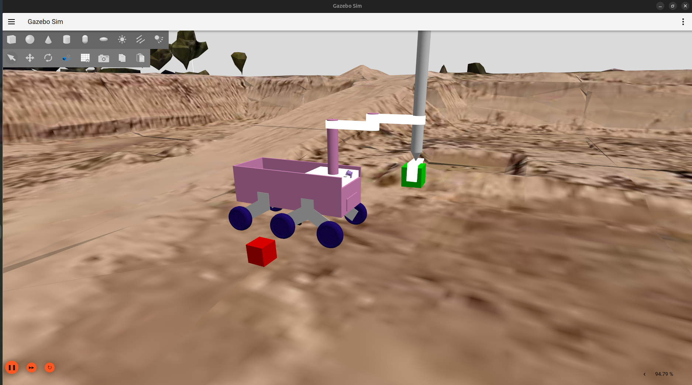

### Cubos azul y rojo 
La segunda tarea consiste en recoger el cubo azul situado a la izquierda del robot y colocarlo sobre el cubo rojo situado a la derecha.

Esta operación requiere reposicionar el rover,
ajustar la orientación del brazo y controlar con precisión la altura del efector final.

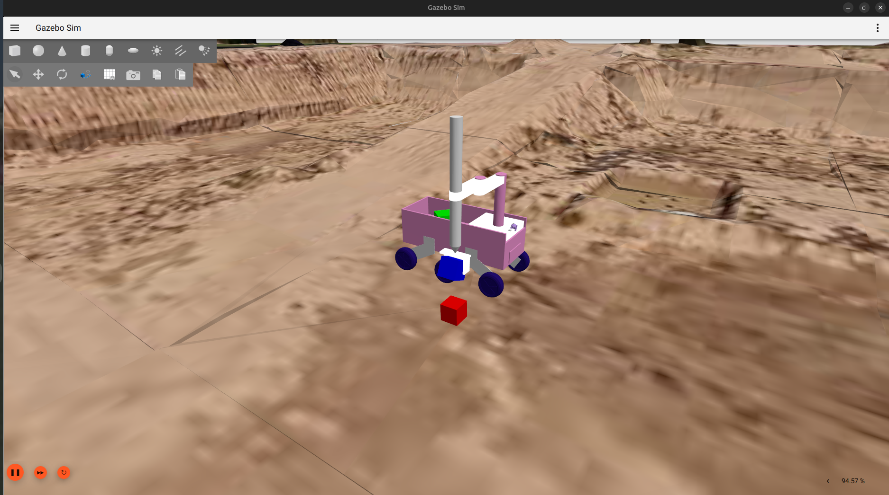

### Rosbag
Durante toda la ejecución se registraron en un rosbag[link al rosbag] los topics `/cmd_vel`, `/imu/data` y `/joint_states` para realizar un análisis posteriormente.

La captura se realizó mediante:

```bash
ros2 bag record -o rosbag_msr_cga /cmd_vel /imu /joint_states
```

## Análisis del mecanismo
A partir de los datos registrados en el rosbag se generaron distintas gráficas para analizar el comportamiento dinámico del robot durante la teleoperación.

### Gasto
Esta gráfica representa una estimación del esfuerzo realizado por el robot a lo largo del tiempo.

El gasto aumenta especialmente durante los desplazamientos largos, los movimientos simultáneos de brazo y base y las maniobras de manipulación de objetos.

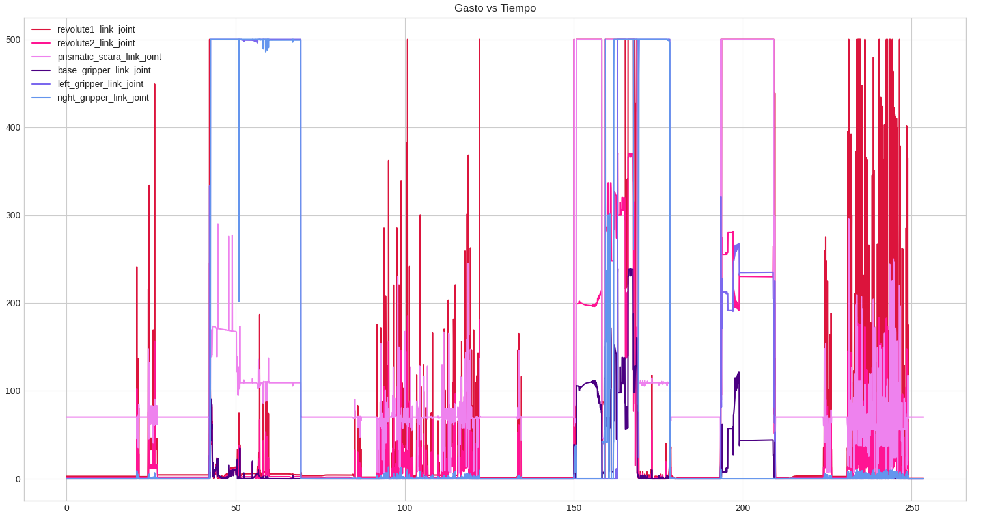

analisis

### Posición de ruedas
La siguiente gráfica muestra la evolución temporal de la posición angular de las ruedas.

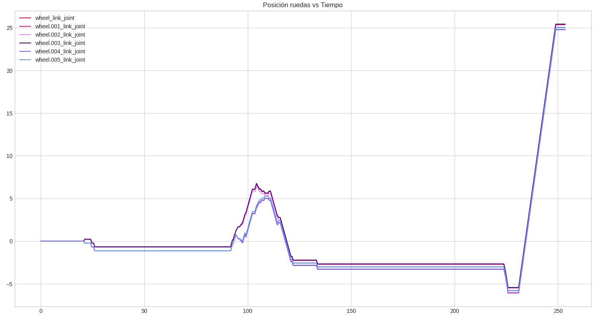

### Aceleración imu
A partir de los datos del sensor IMU se representó la aceleración del robot respecto al tiempo.

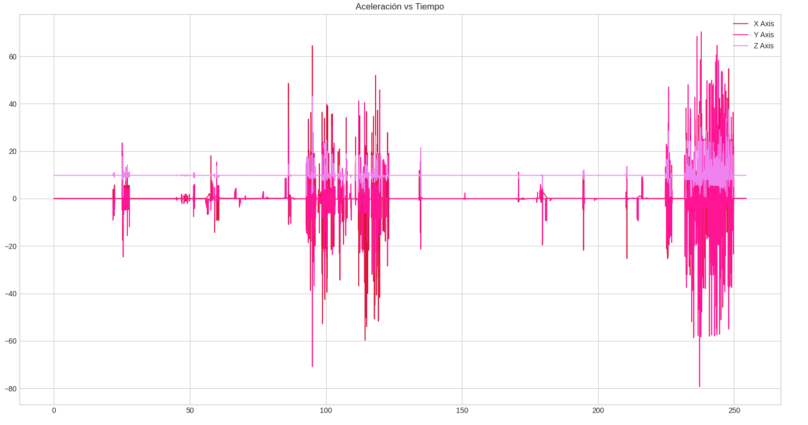

## Conclusiones

## Referencias

----------------------------------------------------------------------
### Carla García Alejandre

